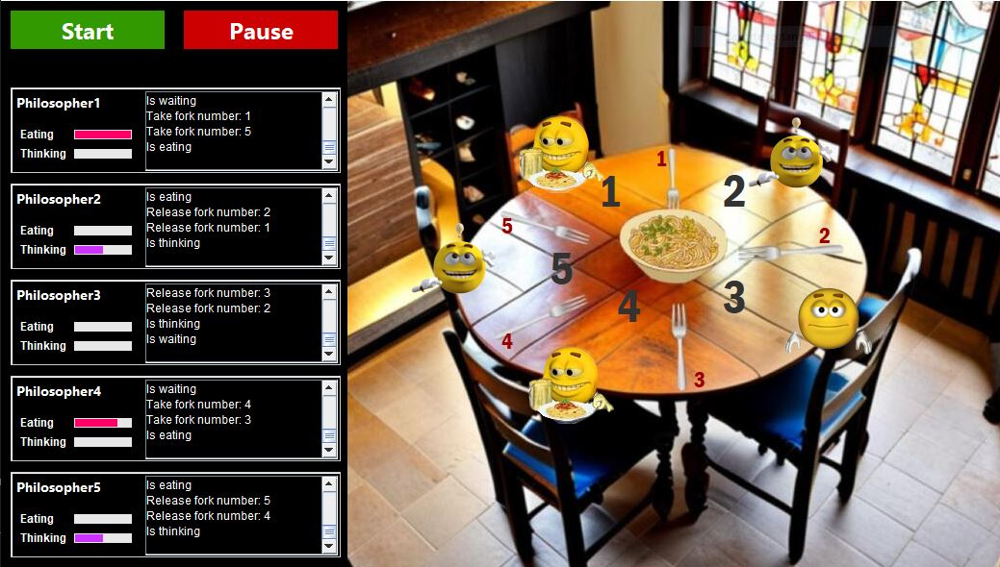
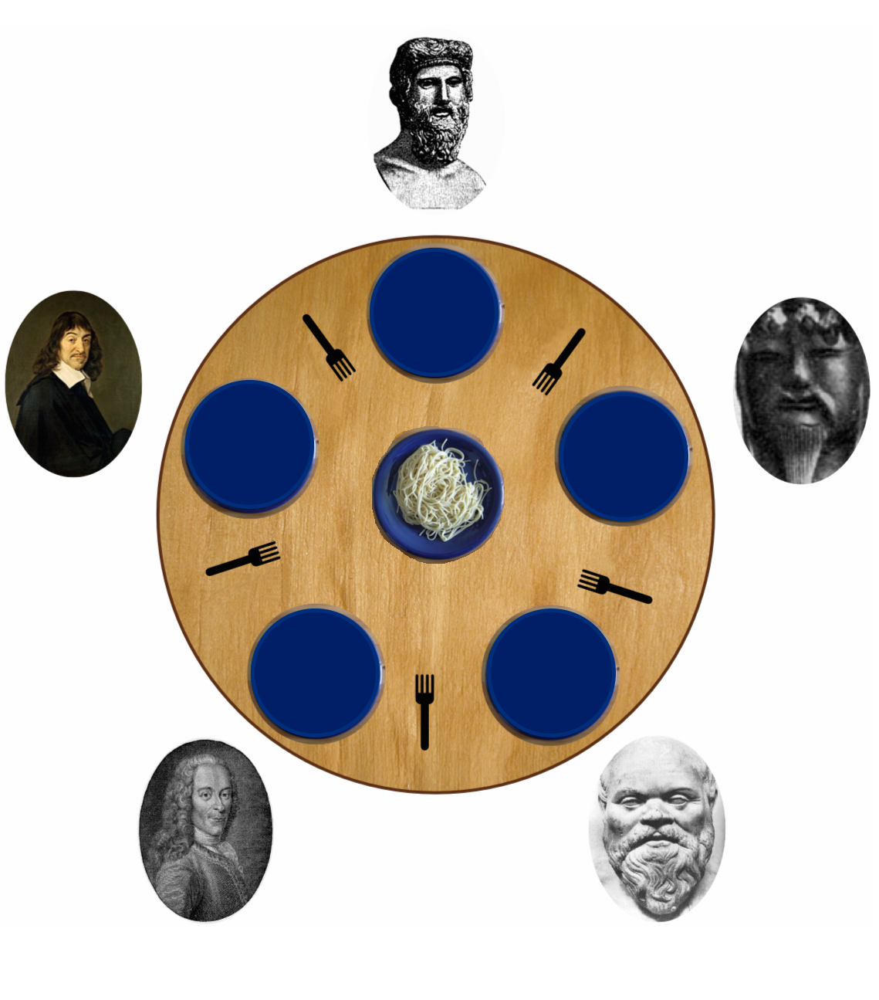
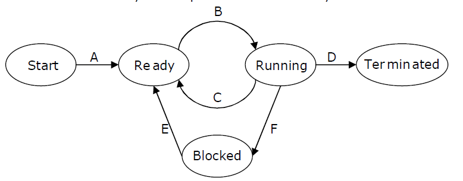
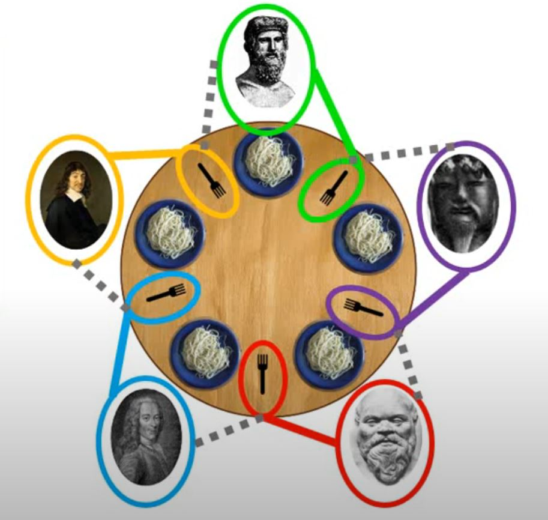

# Dining Philosophers 📖

## Implementation 🚀
<ul>
    <li>Progress bars intervals of 25% for "eating" and "thinking" states (not "waiting" because the time is unknown). </li>
    <li>Graphic changes of every philosopher state (sleeping, eating, thinking, waiting). </li>
    <li>Implementation of a toggle pause/resume button, when the lifecycle of philosophers finish they fall asleep. </li>
    <li>MVC architecture, controller communicates states between view and models. </li>
    <li>Graphic Console for each philosopher to monitor states and shared resources (forks). </li>
    <li>Friendly User Interface. </li>
</ul>

 
    

## Problem Description 💡

    Five philosophers sit at the table, each one has a plate of spaghetti. 
    The spaghetti is so slippery that a philosopher needs two forks to eat it. 
    Between every two plates, there is a fork.

    

    The life of a philosopher consists of alternating periods for eating and thinking. When a philosopher is hungry, they try to get a fork for their left hand and another for their right hand, picking them up one at a time and in any order. If they manage to obtain both forks, they eat for a while and then they put the forks down and continue thinking.

## Requirements of the Program🔍
<ul>
    <li>Graphic environment.</li>
    <li>Controls and actions for interaction with the environment of each problem.</li>
    <li>Comprehensive monitoring of the states and behavior of each process.</li>
    <li>Comprehensive monitoring of the state and behavior of each shared resource.</li>
    <li>Execution threads must accurately implement the states of the processes.</li>
</ul>

## Process State Explanation 🔧

    We have 3 main states.
    <ol>
        <li>Ready</li>
        <li>Running</li>
        <li>Waiting</li>
    </ol>
    A process can't pass from "blocked" to "running", it have to go change its state to "ready". 

    

## Abstraction of Project Concepts 🔧

**Thread:** Philosopher 
**Async Task:**  Taking or Leaving a Fork 
**Shared Resource:** Fork (2 philosopher can't share a single fork simultaneously). 
**Critical Section:** When a Philosopher takes a fork and notifies the other four philosophers. 

## What if? Cases ❓❓❓

### Deadlock Case
<ol>
    <li>All philosophers are hungry at the same time.</li>
    <li>Every philospher sits</li>
    <li>Every philosopher takes the fork on their left</li>
    <li>Every philosopher tries to take the fork on their right</li>
</ol>

 
    

    If we analyze this case, we can conclude that all the philosophers would be in the thinking mode, and they will wait for the fork on their right, but this will never happen. 
    This problem finds practical application in Operating Systems, particularly in contexts involving memory, file systems, and more. 
    We don't want two processes that mutually lock each other out. Process A could be waiting for the result of process B and B could be waiting for the result of process A... 
    To solve this we will use a monitor, this can control the order in which things happen. This is done using a "lock", we can request access and other people can't get access, then the lock is returned and everyone can request again.  
    Lock must be atomic, we must implement a mechanism so if 2 philosophers ask for the right to pick up fork, just one request of the lock will be successful.

